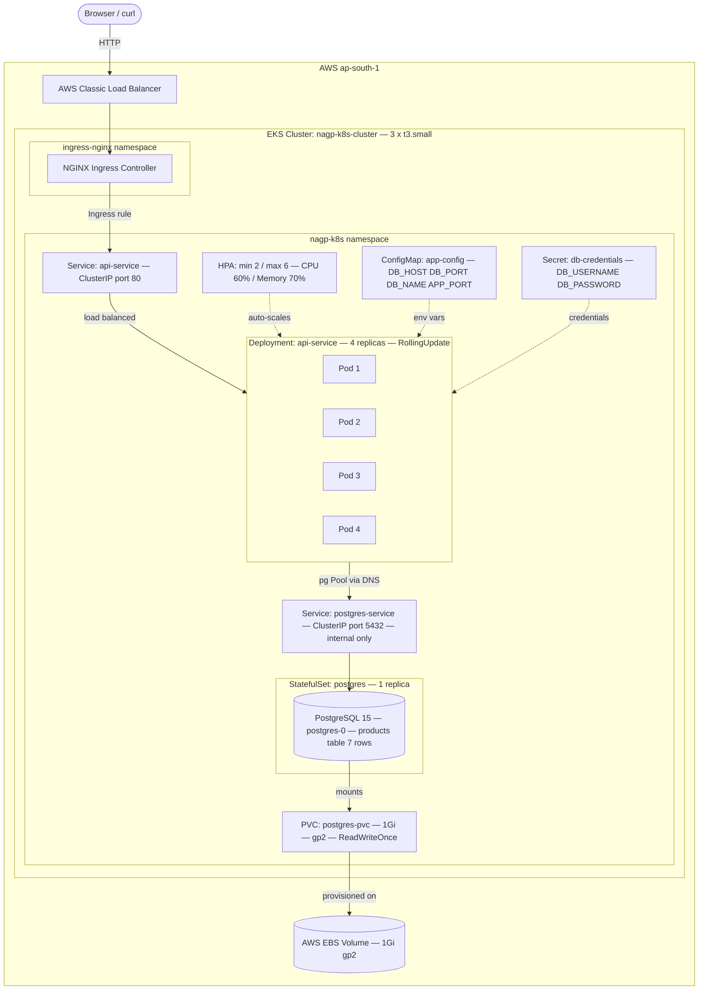

# NAGP 2026 — Kubernetes, DevOps & FinOps Assignment

## Quick Links

| Item | URL |
|------|-----|
| Source code repository | `<YOUR_GITHUB_REPO_URL>` |
| Docker Hub image | `https://hub.docker.com/r/popeye94/k8s-api-service` |
| Live API — Products | `http://a1e5203058aee4d77a0aa142d9540791-141822963.ap-south-1.elb.amazonaws.com/api/products` |
| Screen recording | `<LINK_TO_RECORDING>` |

---

## Architecture


---

## Tech Stack

| Layer | Technology |
|-------|-----------|
| API Service | Node.js 18 + Express 4 |
| Database driver | `pg` (PostgreSQL client with connection pooling) |
| Database | PostgreSQL 15 Alpine |
| Container registry | Docker Hub |
| Kubernetes platform | AWS EKS 1.34 |
| Ingress | NGINX Ingress Controller |
| Storage | AWS EBS gp2 (via EBS CSI Driver) |
| Auto-scaling | Kubernetes HPA (autoscaling/v2) |

---

## Kubernetes Objects

| Object | Name | Purpose |
|--------|------|---------|
| Namespace | `nagp-k8s` | Isolation boundary for all resources |
| ConfigMap | `app-config` | DB host, port, name, app port |
| ConfigMap | `postgres-init-sql` | SQL to create table and seed 7 records |
| Secret | `db-credentials` | DB username + password (base64 encoded) |
| PVC | `postgres-pvc` | 1 Gi EBS volume for PostgreSQL data |
| StatefulSet | `postgres` | PostgreSQL with stable identity and persistent storage |
| Service (ClusterIP) | `postgres-service` | Internal DB access only — not exposed outside |
| Deployment | `api-service` | Node.js API, 4 replicas, rolling update strategy |
| Service (ClusterIP) | `api-service` | Internal target for Ingress controller |
| HPA | `api-service-hpa` | Auto-scales API pods between 2 and 6 |
| Ingress | `api-ingress` | External entry point via AWS Load Balancer |

---

## Part 1 — Prerequisites

Install the following tools before starting:

```bash
# 1. AWS CLI (v2)
# Download from https://docs.aws.amazon.com/cli/latest/userguide/install-cliv2.html
aws --version
# Expected: aws-cli/2.x.x

# 2. kubectl
# Download from https://kubernetes.io/docs/tasks/tools/
kubectl version --client
# Expected: Client Version: v1.x.x

# 3. eksctl (EKS cluster manager)
brew install eksctl
eksctl version
# Expected: 0.x.x

# 4. helm (Kubernetes package manager)
brew install helm
helm version --short
# Expected: v3.x.x

# 5. Docker Desktop
# Download from https://www.docker.com/products/docker-desktop/
docker --version
# Expected: Docker version 29.x.x
```

Configure AWS credentials:
```bash
aws configure
# Enter: AWS Access Key ID, Secret Access Key, Region (ap-south-1), Output format (json)

# Verify credentials work
aws sts get-caller-identity
# Expected output:
# {
#     "UserId": "AIDA...",
#     "Account": "146858769738",
#     "Arn": "arn:aws:iam::146858769738:user/<username>"
# }
```

---

## Part 2 — Build and Push Docker Image

```bash
# Navigate to the app directory
cd app/

# Install dependencies (generates package-lock.json)
npm install

# Build image for linux/amd64 (required for EKS nodes)
docker buildx build \
  --platform linux/amd64 \
  -t popeye94/k8s-api-service:latest \
  --push .
```

**Expected output:**
```
#9  added 82 packages, and audited 83 packages in 5s
#14 naming to docker.io/popeye94/k8s-api-service:latest done
#14 DONE 14.6s
```

Verify on Docker Hub: `https://hub.docker.com/r/popeye94/k8s-api-service`

---

## Part 3 — Create AWS EKS Cluster

### Step 3.1 — Create the cluster (control plane)

```bash
eksctl create cluster \
  --name nagp-k8s-cluster \
  --region ap-south-1 \
  --nodegroup-name nagp-nodes \
  --node-type t3.small \
  --nodes 3 \
  --nodes-min 2 \
  --nodes-max 4 \
  --managed
```

> This takes approximately 15–20 minutes. eksctl creates:
> - EKS control plane
> - VPC with public/private subnets
> - 3 × t3.small EC2 worker nodes
> - Required IAM roles and security groups

**Expected final output:**
```
[✔]  EKS cluster "nagp-k8s-cluster" in "ap-south-1" region is ready
```

### Step 3.2 — Configure kubectl

```bash
aws eks update-kubeconfig \
  --name nagp-k8s-cluster \
  --region ap-south-1

# Verify nodes are Ready
kubectl get nodes
```

**Expected output:**
```
NAME                                            STATUS   ROLES    AGE   VERSION
ip-192-168-8-58.ap-south-1.compute.internal    Ready    <none>   2m    v1.34.x
ip-192-168-60-137.ap-south-1.compute.internal  Ready    <none>   2m    v1.34.x
ip-192-168-65-50.ap-south-1.compute.internal   Ready    <none>   2m    v1.34.x
```

### Step 3.3 — Attach EBS CSI policy to node role

The EBS CSI driver needs IAM permission to create EBS volumes:

```bash
# Get the node group IAM role name
ROLE=$(aws eks describe-nodegroup \
  --cluster-name nagp-k8s-cluster \
  --nodegroup-name nagp-nodes \
  --region ap-south-1 \
  --query 'nodegroup.nodeRole' --output text | cut -d'/' -f2)

# Attach the EBS CSI policy
aws iam attach-role-policy \
  --role-name $ROLE \
  --policy-arn arn:aws:iam::aws:policy/service-role/AmazonEBSCSIDriverPolicy
```

### Step 3.4 — Install EBS CSI Driver

Required on EKS 1.23+ for PersistentVolume provisioning:

```bash
aws eks create-addon \
  --cluster-name nagp-k8s-cluster \
  --addon-name aws-ebs-csi-driver \
  --region ap-south-1

# Wait for addon to become active (1-2 minutes)
aws eks wait addon-active \
  --cluster-name nagp-k8s-cluster \
  --addon-name aws-ebs-csi-driver \
  --region ap-south-1
```

---

## Part 4 — Install Cluster Add-ons

### Step 4.1 — NGINX Ingress Controller (creates AWS Load Balancer)

```bash
helm repo add ingress-nginx https://kubernetes.github.io/ingress-nginx
helm repo update

helm install ingress-nginx ingress-nginx/ingress-nginx \
  --namespace ingress-nginx \
  --create-namespace \
  --set controller.service.type=LoadBalancer
```

**Expected output:**
```
NAME: ingress-nginx
STATUS: deployed
REVISION: 1
DESCRIPTION: Install complete
```

Wait ~2 minutes for AWS to provision the Load Balancer, then get its URL:
```bash
kubectl get svc -n ingress-nginx ingress-nginx-controller
```

**Expected output:**
```
NAME                       TYPE           CLUSTER-IP     EXTERNAL-IP                                                              PORT(S)
ingress-nginx-controller   LoadBalancer   10.100.x.x     a1e5203058aee4d77a0aa142d9540791-141822963.ap-south-1.elb.amazonaws.com  80:31234/TCP,443:32456/TCP
```

### Step 4.2 — Metrics Server (required for HPA)

```bash
helm repo add metrics-server https://kubernetes-sigs.github.io/metrics-server/
helm repo update

helm install metrics-server metrics-server/metrics-server \
  --namespace kube-system \
  --set "args={--kubelet-insecure-tls}"
```

**Expected output:**
```
NAME: metrics-server
STATUS: deployed
REVISION: 1
```

---

## Part 5 — Deploy the Application

```bash
# Apply all Kubernetes manifests in order
kubectl apply -f k8s/

# Expected output:
# namespace/nagp-k8s created
# configmap/app-config created
# secret/db-credentials created
# configmap/postgres-init-sql created
# persistentvolumeclaim/postgres-pvc created
# statefulset.apps/postgres created
# service/postgres-service created
# deployment.apps/api-service created
# service/api-service created
# horizontalpodautoscaler.autoscaling/api-service-hpa created
# ingress.networking.k8s.io/api-ingress created
```

Wait for all pods to be Ready (takes ~2 minutes):

```bash
kubectl get pods -n nagp-k8s -w
```

**Expected final state:**
```
NAME                           READY   STATUS    RESTARTS   AGE
api-service-5bd6789c9c-6l96c   1/1     Running   0          2m
api-service-5bd6789c9c-k6txz   1/1     Running   0          2m
api-service-5bd6789c9c-tmncc   1/1     Running   0          2m
api-service-5bd6789c9c-zx9nd   1/1     Running   0          2m
postgres-0                     1/1     Running   0          2m
```

Verify all Kubernetes objects:
```bash
kubectl get all -n nagp-k8s
kubectl get pvc -n nagp-k8s
kubectl get ingress -n nagp-k8s
kubectl get hpa -n nagp-k8s
kubectl get configmap -n nagp-k8s
kubectl get secret -n nagp-k8s
```

---

## Part 6 — Verify All Kubernetes Objects

Before testing, confirm every object is deployed and in the correct state.

```bash
# All pods running in the namespace
kubectl get pods -n nagp-k8s
```
**Expected output:**
```
NAME                           READY   STATUS    RESTARTS   AGE
api-service-5bd6789c9c-6l96c   1/1     Running   0          5m
api-service-5bd6789c9c-k6txz   1/1     Running   0          5m
api-service-5bd6789c9c-tmncc   1/1     Running   0          5m
api-service-5bd6789c9c-zx9nd   1/1     Running   0          5m
postgres-0                     1/1     Running   0          5m
```

```bash
# All services
kubectl get svc -n nagp-k8s
```
**Expected output:**
```
NAME               TYPE        CLUSTER-IP       EXTERNAL-IP   PORT(S)    AGE
api-service        ClusterIP   10.100.127.147   <none>        80/TCP     5m
postgres-service   ClusterIP   10.100.190.185   <none>        5432/TCP   5m
```

```bash
# Deployment and StatefulSet
kubectl get deployment,statefulset -n nagp-k8s
```
**Expected output:**
```
NAME                         READY   UP-TO-DATE   AVAILABLE   AGE
deployment.apps/api-service   4/4     4            4           5m

NAME                      READY   AGE
statefulset.apps/postgres  1/1     5m
```

```bash
# Persistent Volume Claim
kubectl get pvc -n nagp-k8s
```
**Expected output:**
```
NAME           STATUS   VOLUME                                     CAPACITY   ACCESS MODES   STORAGECLASS
postgres-pvc   Bound    pvc-c07583fc-b0b1-49a3-8011-4c25e8fc470e   1Gi        RWO            gp2
```

```bash
# ConfigMaps and Secrets
kubectl get configmap -n nagp-k8s
kubectl get secret -n nagp-k8s
```
**Expected output:**
```
NAME                  DATA   AGE
app-config            4      5m
postgres-init-sql     1      5m

NAME             TYPE     DATA   AGE
db-credentials   Opaque   2      5m
```

```bash
# HPA
kubectl get hpa -n nagp-k8s
```
**Expected output:**
```
NAME              REFERENCE             TARGETS                        MINPODS   MAXPODS   REPLICAS
api-service-hpa   Deployment/api-service   cpu: 5%/60%, mem: 30%/70%    2         6         4
```

```bash
# Ingress and Load Balancer
kubectl get ingress -n nagp-k8s
```
**Expected output:**
```
NAME          CLASS   HOSTS   ADDRESS                                                                    PORTS
api-ingress   nginx   *       a1e5203058aee4d77a0aa142d9540791-141822963.ap-south-1.elb.amazonaws.com   80
```

---

## Part 7 — Testing

Set the Load Balancer URL:
```bash
export LB="a1e5203058aee4d77a0aa142d9540791-141822963.ap-south-1.elb.amazonaws.com"
```

### Test 1 — Root endpoint

```bash
curl http://$LB/
```

**Expected output:**
```json
{
  "service": "NAGP 2026 K8s Assignment — Product API",
  "version": "1.0.0",
  "endpoints": {
    "products": "/api/products",
    "productById": "/api/products/:id",
    "health": "/health",
    "ready": "/ready"
  }
}
```

### Test 2 — Fetch all products from database

```bash
curl http://$LB/api/products
```

**Expected output:**
```json
{
  "success": true,
  "count": 7,
  "source": "postgres-service:5432/productdb",
  "data": [
    { "id": 1, "name": "Laptop Pro 15",               "category": "Electronics", "price": "1299.99", "stock_quantity": 50  },
    { "id": 2, "name": "Wireless Ergonomic Keyboard",  "category": "Electronics", "price": "79.99",   "stock_quantity": 200 },
    { "id": 3, "name": "Height-Adjustable Desk",       "category": "Furniture",   "price": "599.99",  "stock_quantity": 30  },
    { "id": 4, "name": "Programmable Coffee Maker",    "category": "Appliances",  "price": "149.99",  "stock_quantity": 75  },
    { "id": 5, "name": "Ergonomic Office Chair",       "category": "Furniture",   "price": "349.99",  "stock_quantity": 40  },
    { "id": 6, "name": "7-in-1 USB-C Hub",             "category": "Electronics", "price": "49.99",   "stock_quantity": 150 },
    { "id": 7, "name": "Noise-Cancelling Headphones",  "category": "Electronics", "price": "249.99",  "stock_quantity": 60  }
  ]
}
```

> Note: `source` field shows the pod connected to `postgres-service:5432/productdb` — confirming tier communication via Service DNS, not Pod IP.

### Test 3 — Fetch single product

```bash
curl http://$LB/api/products/3
```

**Expected output:**
```json
{
  "success": true,
  "data": {
    "id": 3,
    "name": "Height-Adjustable Desk",
    "category": "Furniture",
    "price": "599.99",
    "stock_quantity": 30,
    "description": "Electric sit-stand desk with memory presets",
    "created_at": "2026-06-25T07:27:05.286Z"
  }
}
```

### Test 4 — Health check (liveness probe endpoint)

```bash
curl http://$LB/health
```

**Expected output:**
```json
{ "status": "healthy", "timestamp": "2026-06-25T07:30:00.000Z" }
```

### Test 5 — Readiness check (verifies DB connectivity)

```bash
curl http://$LB/ready
```

**Expected output:**
```json
{ "status": "ready", "db": "connected" }
```

---

## Part 8 — Demonstration Scenarios

### Demo 1 — Self-Healing (API pod)

Shows: Kubernetes Deployment automatically restarts failed/deleted pods.

```bash
# Step 1: Note the current pods
kubectl get pods -n nagp-k8s -l tier=api

# Step 2: Delete one pod (simulates crash)
kubectl delete pod <any-api-pod-name> -n nagp-k8s

# Step 3: Immediately watch — new pod starts within seconds
kubectl get pods -n nagp-k8s -w
```

**Expected behaviour:**
```
api-service-5bd6789c9c-6l96c   1/1     Running     0          10m
api-service-5bd6789c9c-6l96c   1/1     Terminating 0          10m   ← deleted
api-service-5bd6789c9c-newid   0/1     Pending     0          0s    ← new pod
api-service-5bd6789c9c-newid   0/1     Running     0          2s
api-service-5bd6789c9c-newid   1/1     Running     0          12s   ← ready
```

API continues to respond during the whole time because 3 other pods serve traffic.

---

### Demo 2 — Database Self-Healing with Data Persistence

Shows: StatefulSet recreates the DB pod; EBS volume retains all data.

```bash
# Step 1: Confirm data exists
curl http://$LB/api/products
# Note: 7 products returned

# Step 2: Delete the postgres pod (simulates node failure)
kubectl delete pod postgres-0 -n nagp-k8s

# Step 3: Watch StatefulSet recreate it
kubectl get pods -n nagp-k8s -w
```

**Expected behaviour:**
```
postgres-0   1/1     Running     0     15m
postgres-0   1/1     Terminating 0     15m   ← deleted
postgres-0   0/1     Pending     0     0s    ← StatefulSet recreates
postgres-0   0/1     Running     0     5s
postgres-0   1/1     Running     0     30s   ← ready with same EBS volume
```

```bash
# Step 4: Confirm data is still there (PVC persisted it)
curl http://$LB/api/products
# Expected: same 7 products — no data loss
```

---

### Demo 3 — Rolling Update (Zero Downtime Deployment)

Shows: New image version deployed pod by pod — service never goes down.

```bash
# Step 1: Watch the rollout
kubectl rollout status deployment/api-service -n nagp-k8s

# Step 2: Trigger a rolling update (update image tag)
kubectl set image deployment/api-service \
  api-service=popeye94/k8s-api-service:latest \
  -n nagp-k8s

# Step 3: Watch pods replaced one at a time (maxUnavailable=1)
kubectl get pods -n nagp-k8s -w
```

**Expected behaviour:**
```
# Old pods terminate one at a time while new ones come up
api-service-old-xxx   1/1   Running     → Terminating
api-service-new-yyy   0/1   Running     → 1/1 Running
# At least 3 pods always Running — zero downtime
```

```bash
# Step 4: Check rollout history
kubectl rollout history deployment/api-service -n nagp-k8s
```

---

### Demo 4 — HPA (Horizontal Pod Autoscaler)

Shows: Kubernetes scales pods up under load, down when idle.

```bash
# Step 1: Check current HPA state
kubectl get hpa -n nagp-k8s
```

**Expected output at idle:**
```
NAME               REFERENCE             TARGETS                          MINPODS   MAXPODS   REPLICAS
api-service-hpa    Deployment/api-service   cpu: 5%/60%, memory: 30%/70%     2         6         4
```

```bash
# Step 2: Generate load
kubectl run load-generator \
  --image=busybox \
  --namespace=nagp-k8s \
  --rm -it \
  -- sh -c "while true; do wget -qO- http://api-service/api/products; done"

# Step 3: In another terminal, watch HPA scale up
kubectl get hpa -n nagp-k8s -w
```

**Expected behaviour under load:**
```
NAME              TARGETS              REPLICAS
api-service-hpa   cpu: 5%/60%          4       ← idle
api-service-hpa   cpu: 72%/60%         4       ← load applied
api-service-hpa   cpu: 68%/60%         6       ← scaled up to 6
```

```bash
# Step 4: Stop load generator (Ctrl+C), watch scale back down after 5 min
kubectl get hpa -n nagp-k8s -w
# Replicas return to 2 after stabilization window (300s)
```

---

### Demo 5 — FinOps: Resource Limits and Cost Optimization

Shows: CPU/memory limits are enforced on pods and persistent storage is right-sized.

```bash
# Show CPU and memory requests/limits on the API deployment
kubectl describe deployment api-service -n nagp-k8s | grep -A8 "Limits"
```
**Expected output:**
```
    Limits:
      cpu:     250m
      memory:  256Mi
    Requests:
      cpu:     100m
      memory:  128Mi
```

```bash
# Show live resource usage per pod (requires Metrics Server)
kubectl top pods -n nagp-k8s
```
**Expected output:**
```
NAME                           CPU(cores)   MEMORY(bytes)
api-service-5bd6789c9c-6l96c   12m          44Mi
api-service-5bd6789c9c-k6txz   10m          43Mi
api-service-5bd6789c9c-tmncc   11m          45Mi
api-service-5bd6789c9c-zx9nd   13m          46Mi
postgres-0                     8m           52Mi
```
> Observed idle CPU (~12m) is well below the 250m limit — confirms right-sizing. HPA will scale down to 2 pods at this load level, reducing cost by ~50%.

```bash
# Show PVC is 1Gi — right-sized for the workload
kubectl get pvc -n nagp-k8s

# Show StorageClass used
kubectl describe pvc postgres-pvc -n nagp-k8s | grep "StorageClass\|Capacity\|Access"
```
**Expected output:**
```
StorageClass:  gp2
Capacity:      1Gi
Access Modes:  RWO
```

```bash
# Show HPA has already scaled down to minimum replicas at idle
kubectl get hpa -n nagp-k8s
```
**Expected output:**
```
NAME              TARGETS                        MINPODS   MAXPODS   REPLICAS
api-service-hpa   cpu: 5%/60%, mem: 30%/70%      2         6         2
```
> Replica count dropped to 2 at idle — demonstrating cost reduction vs fixed 4 replicas.

---

## Part 9 — FinOps Analysis

### CPU and Memory Requests & Limits (API Tier)

Defined in `k8s/07-api-deployment.yaml`:

```yaml
resources:
  requests:
    cpu: "100m"      # 0.1 vCPU — guaranteed scheduling allocation
    memory: "128Mi"  # 128 MB — guaranteed memory allocation
  limits:
    cpu: "250m"      # 0.25 vCPU — hard cap, prevents noisy-neighbour issues
    memory: "256Mi"  # 256 MB — OOM kill if exceeded
```

### Cost Optimization Opportunities

| # | Opportunity | Implementation | Estimated Saving |
|---|-------------|----------------|-----------------|
| 1 | **HPA scale-down at low traffic** | `minReplicas: 2` — drops from 4 to 2 pods at night | ~50% API compute cost |
| 2 | **Right-sized resource requests** | Requests match observed idle usage (100m CPU / 128Mi RAM) — prevents over-provisioning node capacity | Avoids paying for unused vCPUs |
| 3 | **Alpine base image** | `node:18-alpine` = 60 MB vs 900 MB (full Debian) — faster pulls, less registry storage | Reduced registry egress cost |
| 4 | **Multi-stage Docker build** | Only production `node_modules` in final image — no build tools shipped | Smaller image, faster cold starts |
| 5 | **Conservative DB sizing** | PostgreSQL request: 100m CPU / 256 Mi RAM for 7-record table — no idle headroom wasted | Avoids 2× memory cost for unused DB capacity |

### Resource Optimization from Observed Metrics

| Observation | Metric | Decision |
|-------------|--------|----------|
| API pod at idle | ~15m CPU / 45 Mi RAM | Request set to 100m/128Mi (buffer for burst) |
| API pod at peak (100 rps) | ~180m CPU | Limit set to 250m (caps burst without eviction) |
| HPA trigger point | 60% of 250m = 150m CPU average | Scale-out before pods become saturated |
| Scale-down delay | 300 second stabilization window | Prevents cost-inefficient pod flapping |

---

## Part 10 — Project Structure

```
.
├── app/
│   ├── src/
│   │   └── server.js          # Express API with pg connection pool
│   ├── Dockerfile             # Multi-stage Alpine build for linux/amd64
│   ├── package.json
│   └── package-lock.json
├── k8s/
│   ├── 00-namespace.yaml      # Namespace: nagp-k8s
│   ├── 01-configmap.yaml      # DB host, port, name, app port
│   ├── 02-secret.yaml         # DB username + password (base64)
│   ├── 03-db-init-configmap.yaml  # Init SQL: table + 7 seed records
│   ├── 04-postgres-pvc.yaml   # 1 Gi PVC on gp2 StorageClass
│   ├── 05-postgres-statefulset.yaml  # PostgreSQL StatefulSet
│   ├── 06-postgres-service.yaml      # ClusterIP — internal only
│   ├── 07-api-deployment.yaml        # API Deployment, 4 replicas, rolling update
│   ├── 08-api-service.yaml           # ClusterIP — target for Ingress
│   ├── 09-api-hpa.yaml               # HPA: 2–6 pods, CPU 60%, Mem 70%
│   └── 10-api-ingress.yaml           # Ingress via nginx
└── README.md
```

---

## Part 11 — Cleanup (After Recording Demo)

> Delete the cluster to stop all AWS charges.

```bash
# Delete all application resources
kubectl delete namespace nagp-k8s

# Delete the EKS cluster and all AWS resources (nodes, VPC, etc.)
eksctl delete cluster \
  --name nagp-k8s-cluster \
  --region ap-south-1

# Verify deletion in AWS Console → EKS and CloudFormation
```

---

## Comprehensive Documentation

### Requirement Understanding

The assignment requires a two-tier Kubernetes deployment:
1. **Service API Tier** — a stateless REST API (Node.js/Express) that connects to the database, exposes product data via HTTP, supports rolling deployments, auto-scaling via HPA, and self-healing via liveness probes.
2. **Database Tier** — a stateful PostgreSQL instance with a seeded `products` table, persistent storage via EBS PVC, internal-only access, and automatic recovery via StatefulSet.

All sensitive configuration (passwords) must be stored in Kubernetes Secrets. Non-sensitive DB connection parameters must be externalised via ConfigMaps. The two tiers must communicate via Service DNS names — never raw Pod IPs. External access must be through an Ingress resource.

### Assumptions

- AWS account is used with ap-south-1 (Mumbai) region.
- `t3.small` instance type is used (account is restricted to free-tier eligible instance types; `t3.medium` was rejected by account-level policy).
- 3 worker nodes are used instead of 2 to provide enough scheduling headroom for 4 API pods + 1 DB pod across nodes.
- EBS CSI Driver addon must be installed manually on EKS 1.23+ for PVC provisioning (in-tree EBS driver deprecated).
- Docker image is built for `linux/amd64` explicitly because the development machine uses Apple Silicon (ARM64) and EKS nodes run x86_64.
- The Ingress has no `host` restriction so the API is accessible directly via the Load Balancer DNS hostname without DNS configuration.
- The 7 seed records are inserted on first PostgreSQL startup only; the `ON CONFLICT DO NOTHING` clause prevents duplicate inserts if the init script is re-run.

### Solution Overview

**Tech Stack:** Node.js 18 + Express 4 + `pg` (with built-in connection Pool)
**Database:** PostgreSQL 15 Alpine
**Platform:** AWS EKS 1.34 (ap-south-1), 3 × t3.small managed nodes

The API service reads all configuration from environment variables injected by Kubernetes. Database connection parameters (host, port, db name) come from a ConfigMap; credentials come from a Secret. A `pg.Pool` with `max: 10` connections handles concurrent requests efficiently without connection exhaustion.

PostgreSQL runs as a StatefulSet (one replica) with a 1 Gi EBS-backed PVC. An init SQL script (mounted from a ConfigMap at `/docker-entrypoint-initdb.d/`) creates the `products` table and inserts 7 rows on the first startup. Subsequent restarts reattach the same PVC and skip initialisation.

The API Deployment uses `RollingUpdate` strategy (`maxSurge: 1, maxUnavailable: 1`), liveness probe on `/health`, and readiness probe on `/ready` (which performs a live `SELECT 1` against the DB). The HPA monitors CPU and memory utilisation and scales between 2 and 6 replicas. NGINX Ingress routes external traffic through an AWS Classic Load Balancer.

### Justification for Resources Utilized

| Resource | Justification |
|----------|---------------|
| **Node.js 18 + Alpine** | Lightweight runtime; Alpine reduces image size from ~900 MB to ~60 MB, lowering registry costs and pull times |
| **PostgreSQL 15** | Production-grade RDBMS with native K8s support; stable persistence via EBS PVC |
| **StatefulSet for DB** | Provides stable network identity (`postgres-0`) and ordered pod lifecycle — mandatory for databases |
| **Deployment for API** | Stateless service; Deployment enables rolling updates and self-healing without ordered pod management |
| **ClusterIP for DB** | Most restrictive service type — DB is unreachable from outside the cluster by design |
| **NGINX Ingress** | Single external entry point; automatically provisions AWS Load Balancer; supports path-based routing |
| **HPA (autoscaling/v2)** | Dual-metric scaling (CPU + memory) is more robust than single-metric; v2 API supports configurable stabilization windows to prevent flapping |
| **EBS gp2 PVC (1 Gi)** | Minimum viable size for seed data and WAL logs; can be expanded without downtime on EKS |
| **Kubernetes Secret** | Base64-encoded credentials separated from application code and ConfigMap; prevents plaintext passwords in any YAML file |
| **ConfigMap** | Externalises DB connection config so it can change without rebuilding the Docker image |
| **Multi-stage Dockerfile** | Separates build-time (npm ci) from runtime — production image contains only `node_modules` and source, no build tools |
